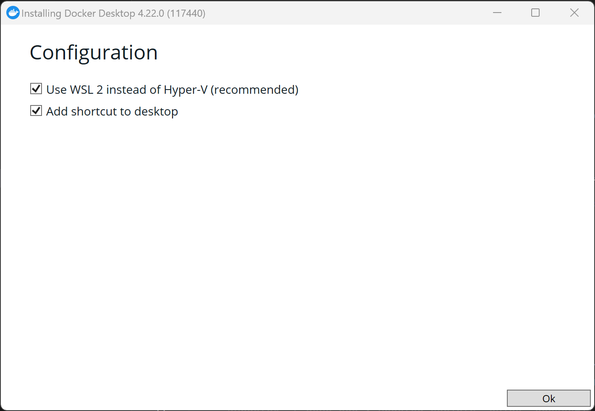
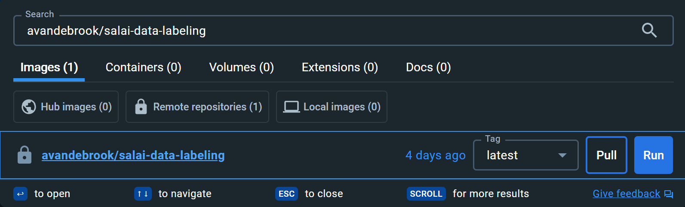
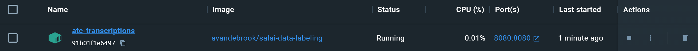
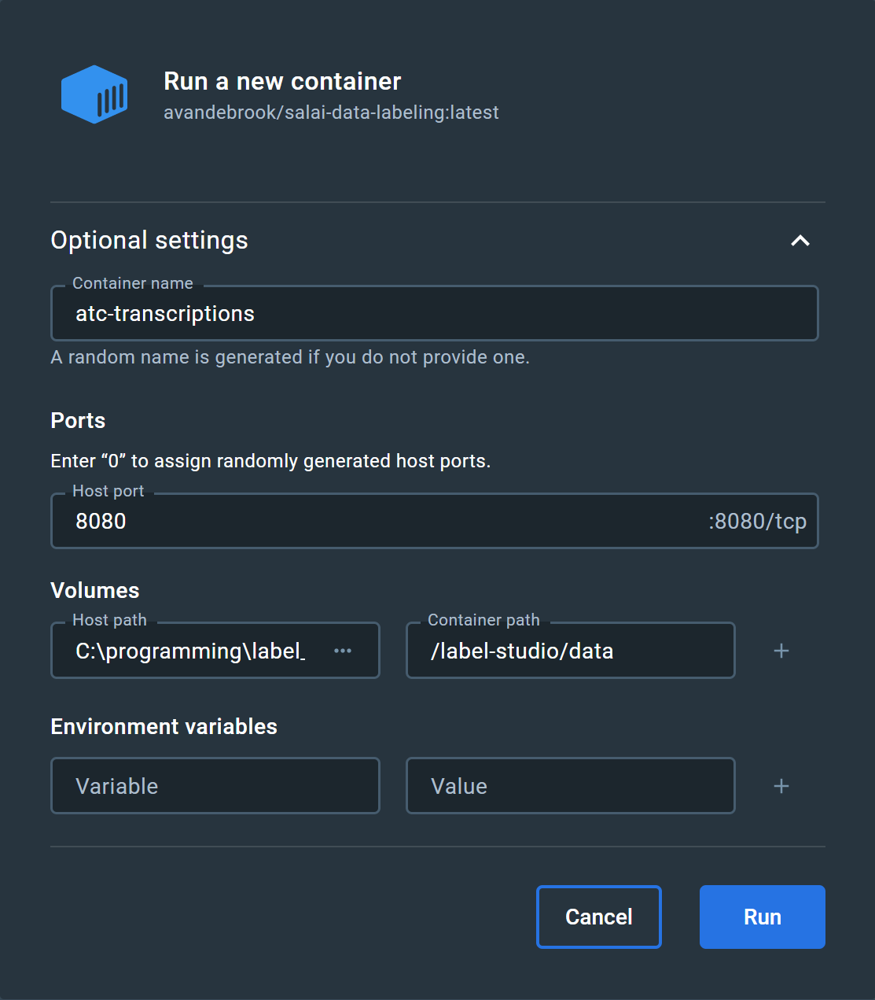
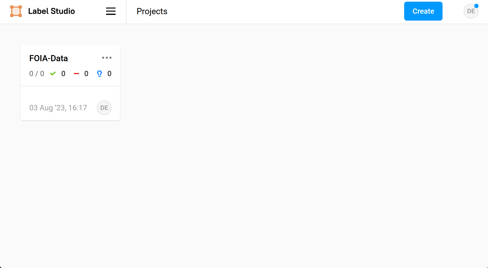
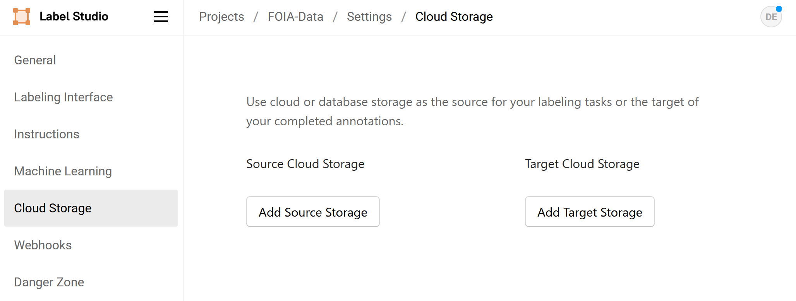
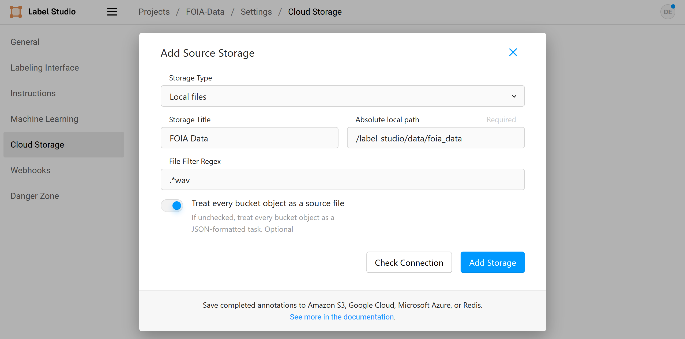
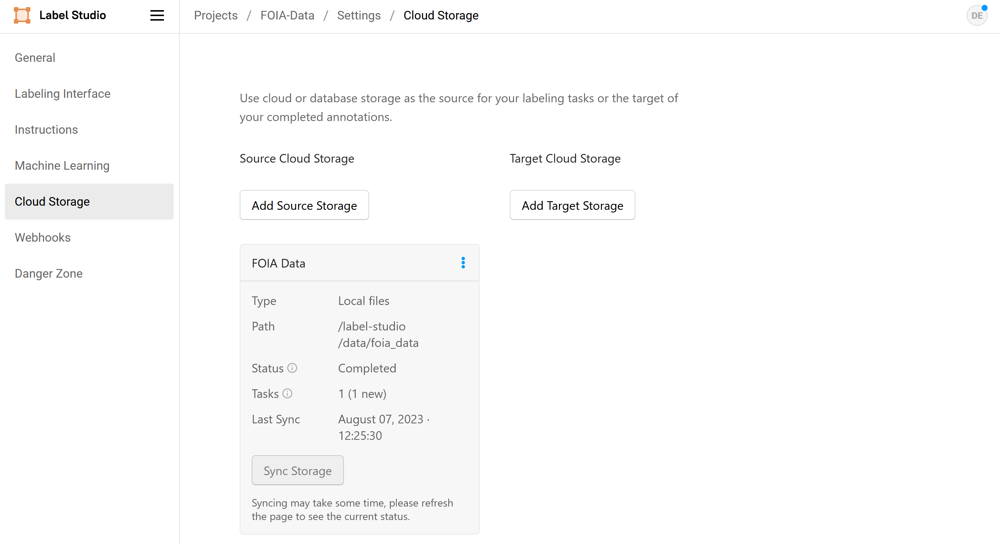
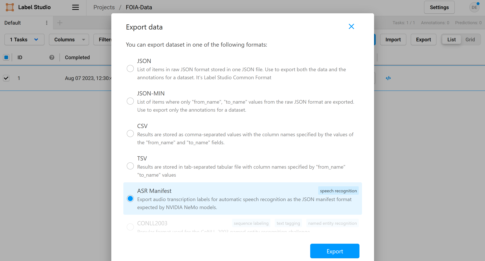

# Label Studio Setup
This is a short guide on setting up and running our custom instance of label studio. Get started with the prerequisite below. The only required software is Docker Desktop. We have set up a custom image with all the required software and a majority of the setup steps completed. This guide will walk you through the last few steps that are required before you can start transcribing our data.

If you are unfamiliar with Docker, you can keep reading to get a basic idea of the software. Otherwise, feel free to skip to [Prerequisite](#prerequisite) to get started setting up Docker and Label Studio.

Docker is a containerization software/service. There are many applications for containerized software (and several other tools available to build software containers) but for our purposes, you can think of Docker as a service that runs custom miniature operating system instances on your computer. The idea is that the host and container are completely separated i.e., the host cannot access the internals of the container and the container cannot access the host unless explicitly specified.

There are a few terms (defined below) that are used frequently in this guide and by Docker:

* image - the preconfigured instance of the software
* container - a running instance of the image
* volume - this is basically a drive that can be shared across containers and/or hosts, in our case it is conceptually identical to a shared folder between the container and the host
* port - an operating system construct that is used to send/receive data between computers or applications

## Prerequisite
* Download and install [Docker Desktop](https://www.docker.com/) for your machine. It is available on all platforms (including Apple Silicon Macs).
  * **On Windows**, under the **Configuration** step in the installer, make sure "Use WSL 2 instead of Hyper-V" is checked, if available.



## Download the Docker Image
Open Docker Desktop and click on the **search bar** at the top of the window. Type (or copy/paste) the following:
```
avandebrook/salai-data-labeling
```
There should be one image listed with the **exact same name**. Select `latest` from the **Tag dropdown** menu. Then click **Pull**.



This will download our customized image to your machine. It may take a little bit depending on the speed of your internet (the image is approximately 1.2 GB). Once it has finished downloading, you should see the image (under the **Images tab**) in Docker Desktop.

*Note: Technically this step doesn't need to be done since the image will automatically be downloaded if the script executes correctly*

## Run the Container
We have created three ways to run the container with the required configurations and options. They are ordered from least to most difficult here.

### Run using the script for your operating system (recommended)
We have created a set of three custom scripts that you can run that will guarantee that the container runs with the correct options/configurations. They are platform specific, so please select the correct one for your operating system:

* The **Windows** script can be [downloaded here](https://raw.githubusercontent.com/AVanDeBrook/salai-data-labeling/main/scripts/windows-run-container.bat) (**right-click** and **Save Link as...**)
* The **Mac** script can be [downloaded here](https://raw.githubusercontent.com/AVanDeBrook/salai-data-labeling/main/scripts/mac-run-container.sh) (**right-click** and **Save Link as...**)
* The **Linux** script can be [downloaded here](https://raw.githubusercontent.com/AVanDeBrook/salai-data-labeling/main/scripts/linux-run-container.sh) (**right-click** and **Save Link as...**)

Create a folder for this project somewhere you can remember and find it again (e.g., your desktop or documents folder), download the script for your system, and save it to that folder.

* On **Windows**, you can double-click the script in the folder from File Explorer to run it. You can close the window at any point and it will continue running in Docker, in the background.
* On **Mac**, [TODO]
* On **Linux**, right-click the whitespace in the folder and select **Open in Terminal**, then type `bash linux-run-container.sh` and press enter.

After running the script, **open Docker Desktop** and go to the **Containers tab**. There should be a **container** called `atc-transcriptions` with the **image** `avandebrook/salai-data-labeling` and the **status** "Running". There will also be two new folders `salai_data`, and within that folder `foia-data`.



If the container is not running, try one of the other methods for running the container. If the folders aren't present, please create them (`salai_data/foia-data`). Otherwise, continue to the [Importing Data step](#importing-data).

### Run using Docker Desktop
This is a slightly more involved process, but can still be completed entirely from the Docker Desktop interface.

Open Docker Desktop, go to the **Images** tab and select the image named `avandebrook/salai-data-labeling`. On the far right, under the **Actions** section, click the play button to run the container.

Another window should pop up with an expandable menu called **Optional settings**, expand it and enter the following:

* In the **Container name** field, type: `atc-transcriptions` (optional)
* Under **Ports**, in the **Host port** field, type: `8080`
* Under **Volumes**, in the **Host path** field, click the three dots on the right side, browse to your project folder, and select the `salai_data` folder (create `salaid_data/foia_data`, if needed)
* Under **Volumes**, in the **Container path** field, type: `/label-studio/data`
* Click **Run** to start the container



Open the **Containers** tab. There should be a **container** called `atc-transcriptions` with the **image** `avandebrook/salai-data-labeling` and the **status** "Running".


If the container is not running, try the last method for running the container. Otherwise, continue to the [Importing Data step](#importing-data).

### Run using Command Line
This is the most involved but reliable way to run the docker container. You will be manually running some of the commands that the script executes in your terminal.

The first step is to open a terminal:

* On **Windows**, open **File Explorer** and go to the project folder you created earlier. Hold shift then right-click in the blank space in the folder. Select the option to either **Open PowerShell window here** or **Open Command Prompt window here**
* On **Mac** and **Linux**, open your **File browser** and go to the project folder you created earlier. Right-click in the blank space and select **Open in Terminal**

Next enter the following commands depending on your platform:

**On Windows**:
```bash
mkdir salai_data/foia_data
docker run -p 8080:8080 -v "%CD%\salai_data":/label-studio/data --name atc-transcriptions avandebrook/salai-data-labeling
```

**On Mac and Linux**:
```bash
mkdir -p salai_data/foia_data
docker run -p 8080:8080 -v "$PWD/salai_data":/label-studio/data --name atc-transcriptions avandebrook/salai-data-labeling
```

There should be a large text output as Label Studio starts. In **Docker Desktop**, under the **Containers tab**, you should also be able to see that the container is running.

If this method fails too, try reinstalling Docker Desktop or contact your manager.

## Importing Data
Download the data that has been allocated to you and move it to the `salai_data/foia_data` folder that was created within your project folder.

Next, open Label Studio by typing `localhost:8080` in the **URL bar of your web browser** or clicking the **hyperlink** in **Docker Desktop** under the **port(s) section of the running container**. This will bring you to Label Studio's login/sign-up page. Sign in to the default user using the following credentials:

* Username: default_user@localhost
* Password: salaiFOIAdata2023

**We highly recommend you change the password for the default user after logging in for the first time.**

Once logged in, there should be a project called "FOIA-Data" on your **Projects** dashboard.



Click on the card to open the project, then click on **Settings** in the top-right corner, go to the **Cloud Storage** tab on the left, then click the **Add Source Storage** button.



Now do the following to get Label Studio to detect the data you downloaded:

* Change **Storage Type** to "Local Files"
* In the **Storage Title** field, type: "FOIA Data"
* In the **Absolute local path** field, type: `/label-studio/data/foia_data`
* In the **File Filter Regex** field, type: `.*wav`
* Check the **Treat every bucket object as a source file** option
* Click **Add Storage**



There should now be a card under the **Cloud Storage** tab called "FOIA Data". It most likely says "0 tasks" and "Not synced yet" towards the bottom of the card. Click the **Sync Storage** button and both fields should update.



## Exporting Data
Once you have finished labeling your data and have submitted your annotations for each task/file. Do the following to export and upload your data:

* Go to the **project dashboard** (where the files to label are listed)
* Click the **checkbox** to the left of each file that is ready to be submitted
* At the top right of the screen, click **Export**
* From the list of export formats, click **ASR Manifest** (towards the bottom)
* Click the **Export** button. It may take a moment to export, depending on your computer.



Once the data has been exported, a ZIP file will be downloaded to your computer.

[Steps to take before uploading to share drive...]

## Technical Notes
* The base OS image is fixed at Ubuntu 22.04
* The project and database for label studio are created toward the end of the image creation script, which saves a ton of time when the user starts the image
* If/when the Python version in the image is upgraded to 3.11+, it will have to be set up differently (pipx instead of pip)
